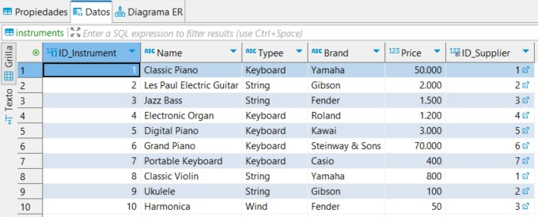
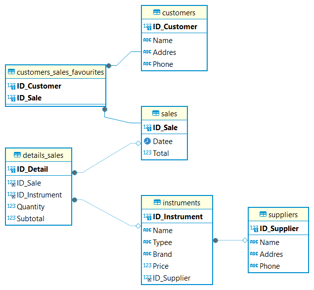

# Midterm de Bases de Datos --> Tienda de instrumentos musicales

# El Projecto
Este proyecto trata una base de datos de una tienda de instrumentos musicales.
Se crea una base de datos con algunas tablas con sus valores y sus relaciones respectivas.
Se realizan una serie de búsquedas y consultas sobre la misma base de datos que nos requiere el ejercicio.
La parte Bonus d ejercicio consta de la parte frontend y la parte backend en la cual conectamos la base se datos que nos permiten realizar opraciones CRUD

# Nuestra Base de datos
Tienda de instrumentos musicales

# La tablas
- **Proveedores**: Almacenamos la información de los proveedores de los instrumentos musicales.
- **Instrumentos**: Almacenamos la información de los instrumentos en el cual incluimos el proveedor o las marcas.
- **Ventas**: Registro de las ventas, fechas, etc.
- **Detalles_Ventas**: Se detallan los productos  que se incluyen en cada venta.
- **Cientes**: Almacenamos los datos clave de los clientes
- **Clientes_Ventas_Favoritas**: Asociamos los clientes con sus ventas favoritas utilizando la relación uno a uno.

Hemos insertado todos los datos correspondientes a cada una de las tablas.

Muestra de tabla:

# Relaciones entre tablas y sus cardinalidades:

- **Proveedores - Instrumentos** (1:N) – Relación de uno a muchos

  **Suppliers - instruments**

Un proveedor puede suministrar múltiples instrumentos, pero un instrumento solo puede ser suministrado por un proveedor.
Lo vemos en  la clave foránea ID_Proveedor en la tabla Instrumentos, que referencia la clave primaria ID_Proveedor en la tabla de Proveedores.

- **Ventas – Detalles_Ventas** (1:N) – Relación de uno a muchos

  **sales - details_sales**

 Una venta puede incluir varios detalles de ventas (por ejemplo, diferentes instrumentos y sus cantidades), pero cada detalle de venta está asociado a una sola venta.  ID_Venta en Detalles_Ventas es una clave foránea que hace referencia  a ID_Venta en la tabla Ventas.

- **Instrumentos - Detalles_Ventas** (1:N) – Relación de uno a muchos

  **instruments - details_sales**

Un instrumento puede aparecer en varios detalles de venta, se puede vender un instrumento concreto en varias ocasiones, pero cada detalle de venta hace referencia a un solo instrumento.
Ejemplo en detalle venta: 1 guitarra tipo fender, 1 guitarra tipo Yamaha, etc.
ID_Instrumento en Detalles_Ventas es una clave foránea que hace referencia a ID_Instumento en la tabla  Instrumento.

- **Clientes - Clientes_Ventas_Favoritas** (1:1) – Relación de uno a uno

  **customers - customers_sales_favourites**

 Cada cliente puede tener una única venta favorita, y cada venta favorita está asignada a un solo cliente. La clave compuesta ID_Cliente, ID_Venta en Clientes_Ventas_Favoritas asegura esta relación uno a uno, junto con la restricción UNIQUE (ID_Cliente).

# El  diagrama de la BBDD:

# Búsquedas y consultas

- Se realizan 10 tipos de búsquedas simples:

- Se realizan  10 tipos de búsquedas complejas

# Triggers
- Se crean dos triggers dentro de la base de datos.
1. Before_Insert_Sales - Trigger para evitar ventas con total negativo
2. Before_Update_Quantity - Este trigger actualiza el subtotal de una venta en details_sales cada vez que se actualiza la cantidad de instrumentos vendidos. Calcula el nuevo subtotal multiplicando la cantidad (NEW.Cantidad) por el precio del instrumento correspondiente

# Transacciones
- Se incluye una  una transacción que incluya varias operaciones de manipulación de datos.
- La transacción que presentamos realiza varias operaciones: inserta una nueva venta, actualiza el total de esa venta y añade los detalles correspondientes en Detalles_Ventas. 

# Funciones
- Se crean  3 funciones definidas por el usuario y las hemos utilizado en las operaciones de la base de datos.
1. CalculateSaleTotal -  Calcula la cantidad total de un instrumento específico que ha sido vendido.
2. GetSupplierName - Devuelve el nombre del proveedor que suministra un instrumento específico.
3. GetTotalQuantitySold -  Calcula la cantidad total de un instrumento específico que ha sido vendido

